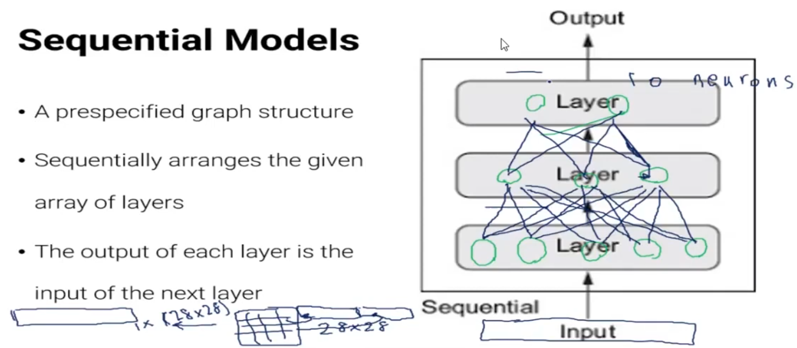
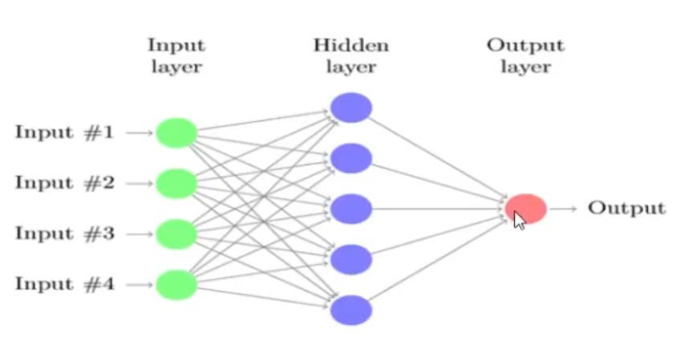
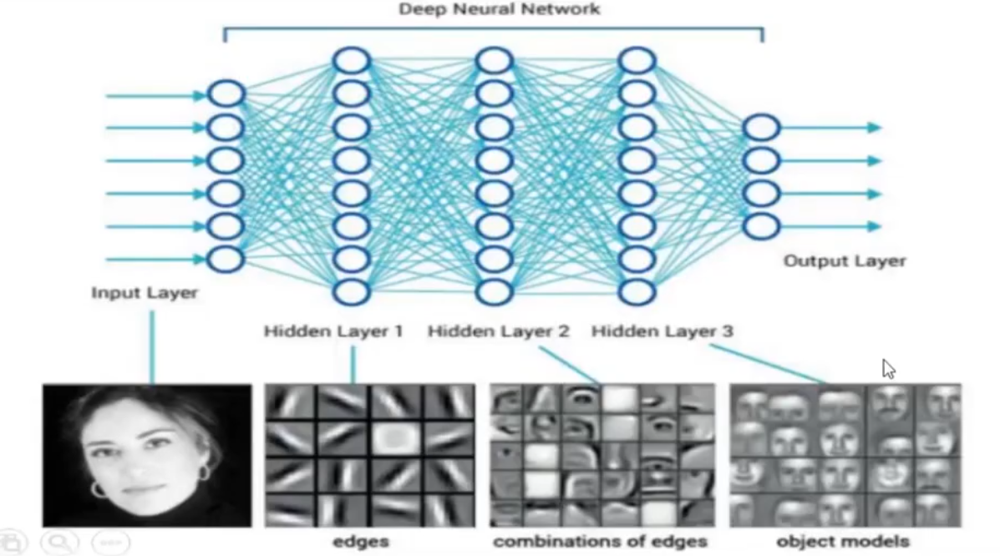

# MLP

A sample architecture for a *sequential model* is a multi-layer perceptron (MLP).

The following (hand-written notes) is a sample of three fully-connected layers of an MLP. When entering the pixels of a 28*28 image as input and getting the output value as tags for a 10-class classification.

## Mathematical concept of an MLP architecture

Look at the following picture:

About what is happening when a network is trained, there can be two expressions:

### Geometrical expression

Assuming no activation function, each neuron learns a line equation so that it splits the input space into two parts. Moving to next layers, the neurons learn to split the input space into shapes which are mixes of previous lines (and shapes). So complex shapes to are achieved in order to classification.

More number of nodes, is the case of solving the problem with more coplex model. Less number of nodes, mean that we are solving the problem simpler models (near to linear)

### Dimensional expression

Another expression is this: A b-node layer, maps the input from its previous a-node layer (an a-dimensional space) to a b-dimensional space. The goal of network training is to transfer data from a space with the same number of dimensions as the input, to a space with the same number of dimensions as the output.

*I other words*, we are to extract features from input data with the same number as next layer nodes. Next layers extract more complicated features of an input compared to prevoius layers. See:

Therefore, the hidden layers are mappings to different multi-dimensional spaces with desired number of dimensions. Thus, about the *strategy of setting number of nodes of hidden layers in an MLP net* it can be stated that:

#### Defining a next layer with more number of node than the previous one, 

Means that we hope our input data are classified better in a space with more dimensions (e.g. are better linearly separatable in more dimensions).

In this case, the number of weights increases; So the training will be harder.

#### Defining a next layer with less number of node than the previous one,

Experimentally, it is seen that lowering the number of target space dimensions happen more, when trying to conclude the classifications in previous layers. *Note that* this conclusion cannot be done immediately after high number of features. For example, you shouldn't expect 5000 nodes to be concluded immediately in a next 1-node layer. Matbe you need a 5000->1000->200->10->1 MLP architecture.

#### Question,

Wide networks with low number of layers vs. deep networks with thin layers. Which is good for what kind of problem?

#### Final hint,

There are no deterministic way to determine the optimal number of nodes. The best nuumber of nodes must be deermined with trial and error.

