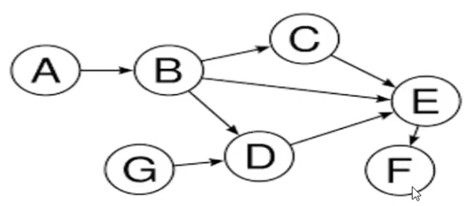
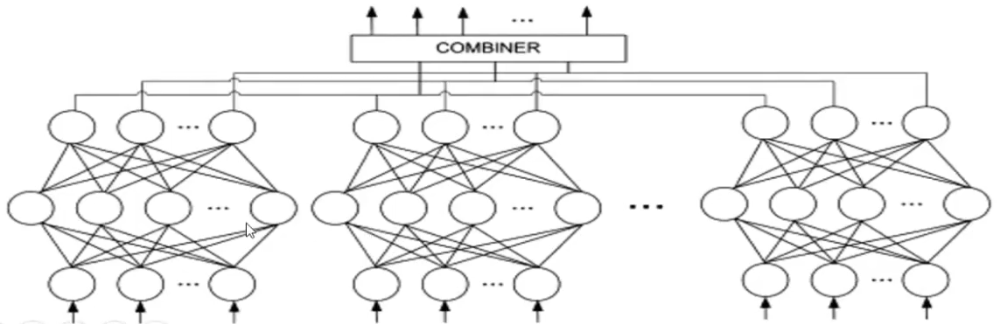

Take a look at this:

In th above, each node is a network layer. To implement such directed graph network, one should:

1- Declare the nodes of the graph (the layers). Doing so, the outputof each layer will be determined.
2- Declare the connections. That means, the input to each layer must be determined

## Ensembled NNs

The network includes multiple MLPs with small abilities and high sensitivity to input (Each MLP has an error value in voting). The output is voted between networks and error value is reduced without exponensial increase in number of weights.