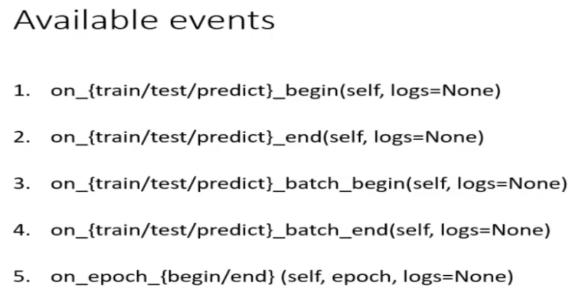

The concept of callbacks is shown in the following:

A callback is used to control the procedure of train/test/predict. A callback's action is executed when a special event occurs. The tf's events are:

