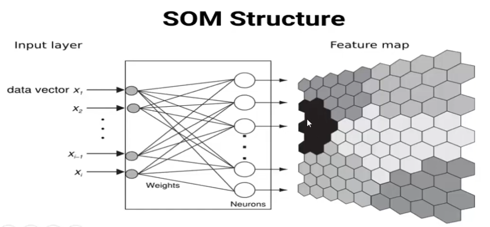
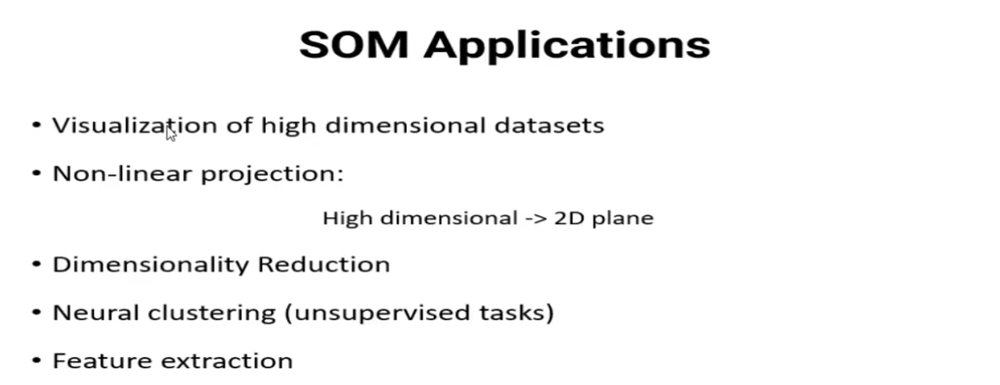
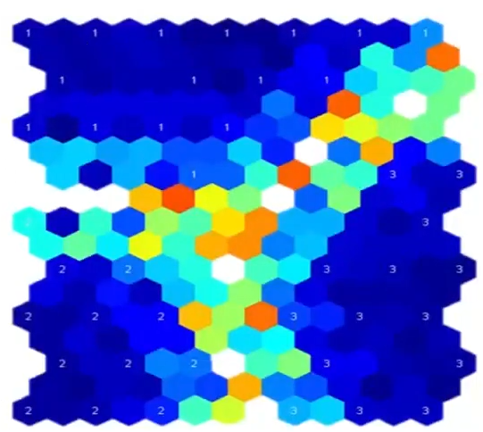
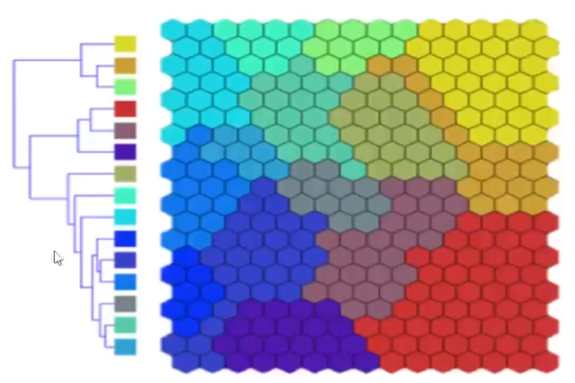
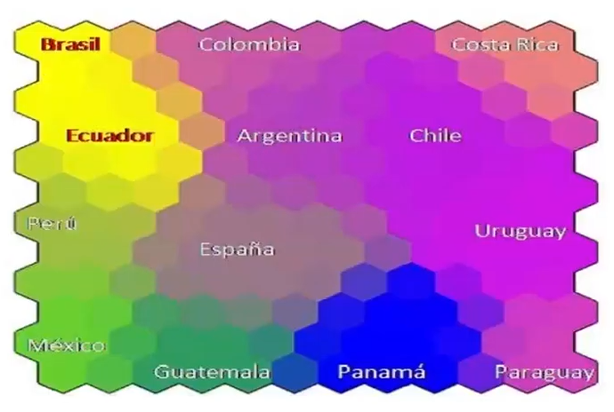
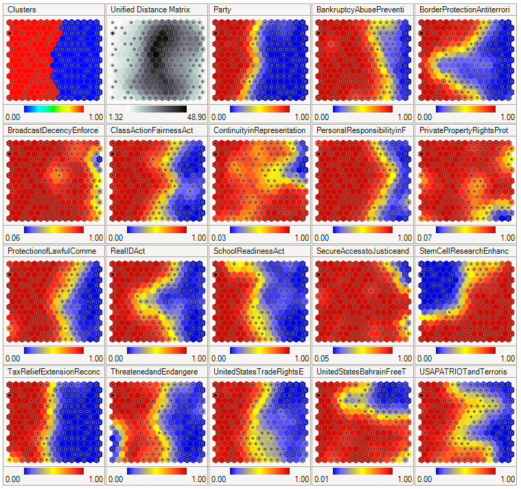
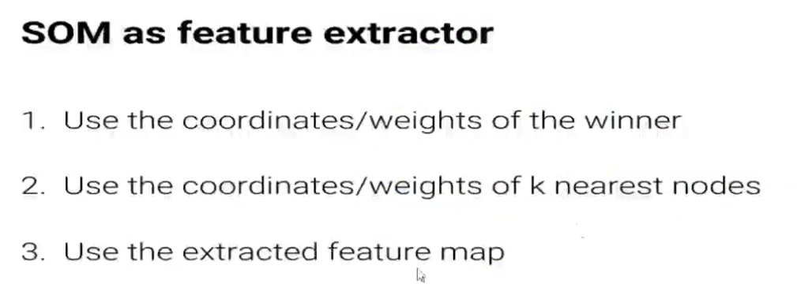
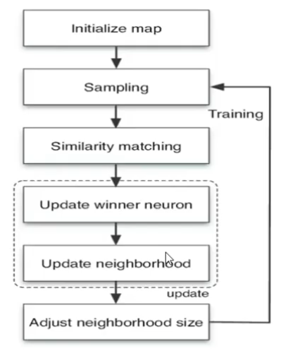

A self-organizing map (SOM) is a network architecture trained with unsupervised learning technique used to produce a low-dimensional (typically two-dimensional) representation of a higher dimensional dataset. This can make high-dimensional data easier to visualize and analyze. 

## Architechture

The following depicts the structure of an SOM network:

As seen in the above, An SOM only contains two layers. The first layer is the inputs. When an input is given to the network, the euclidean distance of the input with each neuron's wieght vector is measured and the nearest neuron returns a higher value in the output. This is just like defining an activation function equal to inverse of distance ... 

## Output

The output of an SOM can be visualized in two forms:

### Painting Cells Based on Mean Euclidean Distance 

What is happening in an SOM network is visualized in the following figure. For each neuron, the mean euclidean distance to the surrounding neurons (in left side) is written in a U-matrix (right side). The numbers are visualized in the figue with colors. High numbers indicate more distinction with the surroundings. Lower numbers remark the dense areas in the mapped inputs. 

If there are a bunch of separated dense areas in an SOM output (U-matrix) like the following figure, each area may refer to a distinct cluster (type) of inputs.

### Painting Cells Based on Input Labels

This way, the output of cells can be something like the following: Each color presents a particular input label.

## Usage

The usages of SOM:

As some examples of the SOM usage, the following cases can be mentioned:

- According to a bunch of input standards, the following SOM indicates how similar are different input clusters

- The following results of SOM, indicate that the 16th (results of a particular voting) feature is much similar to 3rd feature (Whcih is the major clustering feature: the party for members of U.S. Congress)

- The followings are some strategies to use SOM networks as feature extractor.

## Training Algorithm

...

About the last step, the important note: The learning rate and neighborhood size must be taken large in the first step. Then they must be decreased.
